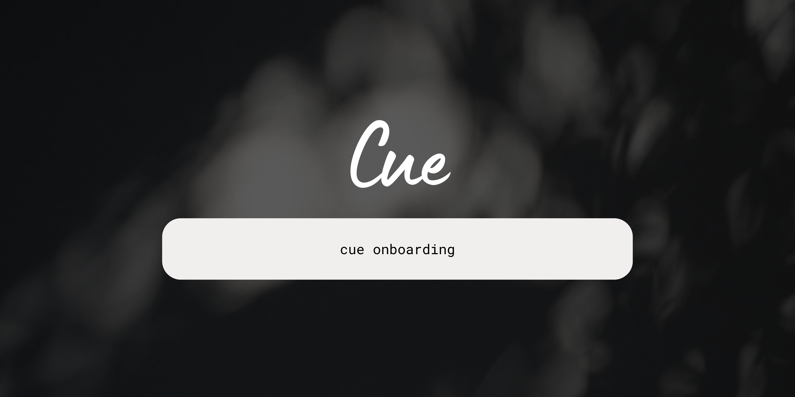

<div align="center">
  

  <h1>Cue</h1>
  <p><strong>Makes the terminal feel like it already knows what you need.</strong></p>

  <p>
    
    
    
    
    
    
  </p>
</div>

<br>

<div align="center">
  <h3>Welcome to v2.0</h3>
  
  <br><br>
  <h3>Environment Store Management</h3>
  
</div>

---

## About — the 5 Ws

**What.** Cue is a Go-based terminal companion that bundles queue management, **semantic macros**, declarative **environment stores**, smart history, and Claude Code orchestration into a single statically-linked binary. No Node, no Python, no Ruby required. Everything runs locally — **zero telemetry**.

**Who.** Built by **Gyanesh Samanta** with contributions from **Chris Chen** ([@fuleinist](https://github.com/fuleinist)).

**When.** Hacked together end-to-end between **March 28 and April 1, 2026** — five days of intense, caffeinated commits to ship v2.0.

**Where.** A solo project that grew out of a chronic frustration with the daily `--help` shuffle that comes with juggling Go, Python, Node, Docker, Terraform, Kubernetes, and an LLM-of-the-week.

**Why.** Modern dev environments demand absurd cognitive overhead. Was it `npm audit fix` or `yarn upgrade`? Did you remember `--force-with-lease`? Which Python is on `$PATH` today? Cue intercepts those needs as readable verbs and provisions whole stacks declaratively, so your terminal stops feeling like a hostile witness.

---

## The Story

The project started with a single observation: every developer keeps a private cheat sheet of "the right way to do X." `git push --force-with-lease` instead of `--force`. `docker system prune -a --volumes` instead of `docker rm $(docker ps -aq)`. `python -m venv .venv && source .venv/bin/activate`. These aren't commands — they're rituals, and forgetting one step quietly nukes a feature branch.

Cue's first move was the **macro engine**: a glossary of safe, opinionated verbs. `cue git-oops-push` does the lease-protected force push. `cue docker-nuke` obliterates containers, volumes, and dangling images in one breath. `cue python-venv-here` scaffolds a venv and prints the activation string so you can copy-paste without thinking. Each macro is a tiny piece of crystallized wisdom — the thing a senior engineer would tell you, packaged so you never need to ask twice. The repo ships with macros across **Git, Docker, Go, Node.js, Python, and AI** categories.

The second move was **Environment Stores**: stop installing toolchains by hand. `cue store install mern` provisions Node, the right package manager, and the boilerplate. There are stacks for [AI & ML](./docs/ai_ml.md) (Claude Code, Ollama, liteLLM), [Data Science](./docs/data_science.md) (Python 3.10+, JupyterLab, Poetry), and [DevOps](./docs/devops.md) (Terraform, Kubernetes, cloud CLIs, Docker). Cue layered a [Bubble Tea](https://github.com/charmbracelet/bubbletea) TUI on top so any forgotten flag launches an interactive menu instead of a wall of `--help` text — the terminal equivalent of a friendly tap on the shoulder.

The third move was the **Claude Code engine**. `cue claude-code install` orchestrates Anthropic's Claude Code with a choice of two execution modes: **API mode** for cloud-grade reasoning, and **Local mode** that pulls models down through Ollama and proxies them, **100% free and private**. Combined with `cue audit` (which locally analyzes SSH structures and flags deprecated RSA over Ed25519) and a vault that keeps API keys in local JSON only, Cue ends up doing something rare: bringing real LLM superpowers to a workflow without ever phoning home.

---

## Installation

The CLI ships as a self-contained, statically linked binary. No Node/Python/Ruby runtime required.

<details>
<summary><b>Linux / macOS</b></summary>

```bash
curl -fsSL https://raw.githubusercontent.com/GyaneshSamanta/cue/main/scripts/install.sh | bash
```

> **Arch Linux:** the install script is fully compatible. For best results with future AUR packaging, ensure `sudo pacman -S base-devel` is installed.
</details>

<details>
<summary><b>Windows (PowerShell)</b></summary>

```powershell
iwr https://raw.githubusercontent.com/GyaneshSamanta/cue/main/scripts/install.ps1 -useb | iex
```
</details>

> **First run:** Cue automatically launches an Onboarding Wizard on your first command. Replay it any time with `cue onboarding`.

---

## Environment Stores

Stop manually installing toolchains. Use specialized environments, loaded dynamically by directory.

```bash
cue store install mern
```

| Stack | Identifier | Primary Components |
| :--- | :--- | :--- |
| **[AI & ML](./docs/ai_ml.md)** | `ai-dev` | Claude Code, Ollama, liteLLM |
| **[Data Science](./docs/data_science.md)** | `data-science` | Python 3.10+, JupyterLab, Poetry |
| **[DevOps](./docs/devops.md)** | `devops` | Terraform, K8s, cloud CLIs, Docker |

---

## Claude Code Engine

```bash
cue claude-code install
```

During install, pick an execution mode:

1. **API mode** — Sends prompts to the cloud. Best for reasoning-heavy tasks.
2. **Local mode (Ollama)** — Pulls models locally and proxies them. **Free and private.**

---

## Macro Glossary

Macros encapsulate best-practices and safety constraints into readable verbs.

| Macro | Category | Purpose |
| :--- | :--- | :--- |
| `cue git-oops-push` | Git | Lease-protected force push to a remote branch |
| `cue git-undo` | Git | Undo last commit, keep files staged |
| `cue docker-nuke` | Docker | Wipe all containers, volumes, dangling images |
| `cue go-mod-tidy-check` | Go | Format, lint, and run the test suite |
| `cue npm-audit-fix` | Node.js | Patch Node vulnerabilities |
| `cue python-venv-here` | Python | Scaffold a venv and print the activation string |
| `cue ollama-chat` | AI | Drop into an optimized REPL chat |

> Run `cue macro list` to see them dynamically in your terminal.

---

## Tech Stack

- **Language:** Go 1.26
- **TUI:** [Bubble Tea](https://github.com/charmbracelet/bubbletea) + [Bubbles](https://github.com/charmbracelet/bubbles) + [Lipgloss](https://github.com/charmbracelet/lipgloss)
- **CLI framework:** [spf13/cobra](https://github.com/spf13/cobra)
- **Storage:** modernc.org/sqlite (pure-Go SQLite — no CGO)
- **Config:** BurntSushi/toml
- **Clipboard:** atotto/clipboard
- **Release:** GoReleaser

---

## Repository Structure

```
cue/
├── cmd/                  # Cobra commands — one file per top-level verb
│   ├── audit.go          # Local SSH/key vulnerability audit
│   ├── claudecode.go     # Claude Code orchestration
│   ├── macro.go          # Semantic macro engine
│   ├── store.go          # Environment Store manager
│   ├── onboarding.go     # First-run wizard
│   └── ...               # 20+ more verbs
├── internal/             # Implementation packages
│   ├── tui/              # Bubble Tea fallback menus
│   ├── macro/            # Macro definitions and runners
│   ├── store/            # Stack provisioners (mern, ai-dev, ...)
│   ├── claudecode/       # Local + API engine wiring
│   ├── audit/            # Offline security checks
│   ├── plugin/           # Plugin loader
│   └── ...
├── docs/                 # Stack docs (ai_ml.md, data_science.md, devops.md)
├── PRD/                  # Product requirements
├── Spec Document/        # Specs
├── scripts/              # install.sh, install.ps1
├── main.go               # Entry point
└── go.mod                # Go 1.26.1, ~10 direct deps
```

---

## Getting Started (from source)

```bash
git clone https://github.com/GyaneshSamanta/cue.git
cd cue
go build -o cue .
./cue onboarding
```

Or run directly:
```bash
go run . macro list
```

---

## Contributing

```bash
# 1. Fork on GitHub, then:
git clone https://github.com/<you>/cue.git
cd cue
git checkout -b feat/your-feature

# 2. Code, build, test
go build -o cue . && ./cue version

# 3. Commit, push, open a PR
git commit -m "feat: short description"
git push origin feat/your-feature
```

> **Standardization rule:** all crashes must use `ui.StructuredError`, not raw `panic`. The structured error guides users on resolving issues themselves.
>
> ```go
> se := ui.NewStructuredError(
>     "Installation Failed",
>     "Dependency 'rustc' dropped connection.",
>     []string{"Check your internet connection", "Run 'cue store install rust' again"},
>     err,
> )
> ui.HandleError(se)
> ```

See [CONTRIBUTING.md](CONTRIBUTING.md) for full guidelines.

---

## Security & Trust

When you run `cue`, **zero telemetry or user data leaves your computer**.

- `cue audit` locally analyzes SSH structures (flags deprecated RSA signatures vs Ed25519).
- TUI menus scrub inputs locally before running.
- LLM API keys are vaulted in local JSON; never logged.

---

## License

[MIT](LICENSE) © 2026 Gyanesh Samanta.

---

## Credits

- **Gyanesh Samanta** — Author, maintainer ([@GyaneshSamanta](https://github.com/GyaneshSamanta))
- **Chris Chen** ([@fuleinist](https://github.com/fuleinist)) — Contributor

<div align="center">
  <p><b>Built with care by Gyanesh.</b></p>
  <a href="https://buymeachai.ezee.li/GyaneshOnProduct">
    
  </a>
</div>
